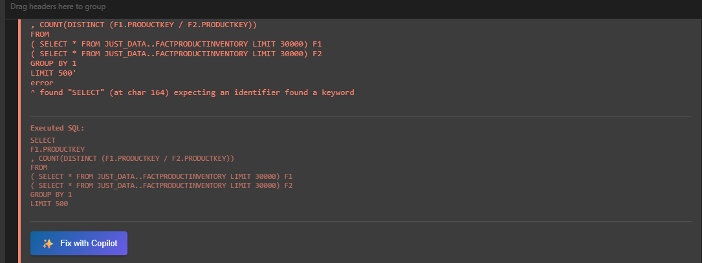
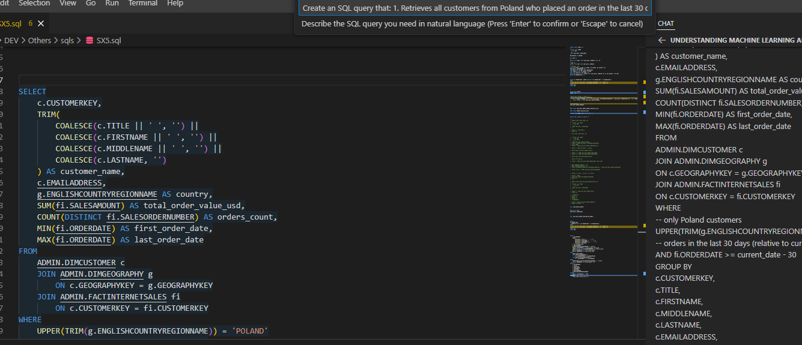

# Copilot SQL Assistant

## Overview

The **Copilot SQL Assistant** integrates GitHub Copilot directly into your SQL editing workflow with **full database context**. Instead of manually copying table schemas or variable information, the extension automatically gathers and sends:

- ✅ Selected SQL code
- ✅ Referenced table DDL (CREATE TABLE statements)
- ✅ Query variables and parameters  
- ✅ Active database connection info
- ✅ Recent query context

This allows Copilot to provide **highly accurate** suggestions, optimizations, and explanations tailored to your specific Netezza schema.

---

## Modes

- **Auto Mode**: Applies suggestions using the built-in diff editor. You get a modal review dialog and can `Apply Changes`, `Apply & Close Diff` or `Discard`.
- **Interactive Mode**: Opens Copilot Chat with full context for a back-and-forth discussion. Responses remain in the Chat panel and are not pasted into your SQL editor unless you explicitly use `/edit` or copy the suggestion.

## Describe Data (Results Grid)

- From the Results panel you can now ask Copilot to "Describe data" for a given result set (button ✨ next to the Analyze button). The data is converted to a Markdown table (first 50 rows for context) and sent to Copilot Chat for analysis.
- For privacy, the extension displays a modal confirmation before sending any result data to Copilot. No data is sent unless you explicitly accept.


## Features

### 1. **Fix SQL with Context** 



Right-click on SQL → `Copilot: Fix SQL with Context`

Copilot analyzes your query and suggests fixes considering:
- Table structure and column names
- Netezza-specific syntax
- Data types and constraints
- Query variables

**Example:** If you have a typo in a table or column name, Copilot will recognize it based on your actual schema.

---

### 2. **Optimize SQL**
Right-click on SQL → `Copilot: Optimize SQL`

Get performance optimization suggestions including:
- Index usage recommendations
- Join optimization strategies
- Distribution key alignment
- Table statistics updates

---

### 3. **Explain SQL**
Right-click on SQL → `Copilot: Explain SQL`

Copilot provides a step-by-step explanation:
- What tables are accessed
- Data transformations
- Expected output
- Potential issues or performance bottlenecks

---

### 4. **Ask Custom Question**
Right-click on SQL → `Copilot: Ask Custom Question`

Ask any question about your SQL with full context. Examples:
- "How can I improve this query?"
- "What's the best way to join these tables?"
- "Will this handle null values correctly?"

---

### 5. **Generate SQL from Natural Language** ⭐ NEW



Right-click in SQL editor → `Copilot: Generate SQL from Description`

Describe what you need in plain English, and Copilot will:
1. Analyze all tables and columns in your current database
2. Identify relevant tables for your request
3. Generate a complete SQL query with proper JOINs and conditions

**Examples of natural language requests:**
- "Find all customers who made purchases over $1000 last month"
- "Show me the top 10 products by revenue with their category names"
- "List employees and their managers with department information"
- "Calculate monthly sales totals by region for 2024"

This feature works in **Interactive Mode** only, opening Copilot Chat with your full database schema context for a back-and-forth conversation.

---

## How It Works

### Context Gathering

When you use any Copilot command:

1. **SQL Extraction** → Reads your selected SQL (or entire file if nothing selected)
2. **Variable Detection** → Finds all variables like `${start_date}` or `${user_id}`
3. **Table Reference Extraction** → Parses FROM, JOIN, INSERT, UPDATE, DELETE clauses
4. **DDL Lookup** → Retrieves table structure from your connected database's metadata cache
5. **Connection Info** → Identifies which Netezza connection you're using

### Prompt Building

The extension constructs a comprehensive prompt like:

```
You are a SQL expert helping with Netezza SQL queries.

DATABASE CONNECTION:
Connected to: prod_netezza

REFERENCED TABLE SCHEMAS:
-- Table: CUSTOMERS
CREATE TABLE CUSTOMERS (
  CUSTOMER_ID: INT NOT NULL
  NAME: VARCHAR(100) NOT NULL
  EMAIL: VARCHAR(100)
);

-- Table: ORDERS
CREATE TABLE ORDERS (
  ORDER_ID: INT NOT NULL
  CUSTOMER_ID: INT NOT NULL
  ORDER_DATE: DATE NOT NULL
  AMOUNT: DECIMAL(10,2)
);

QUERY VARIABLES:
Variables: ${start_date}, ${end_date}

CURRENT SQL:
SELECT * FROM CUSTOMERS c
JOIN ORDERS o ON c.CUSTOMER_ID = o.CUSTOMER_ID
WHERE o.ORDER_DATE > ${start_date}

User request: Please optimize this query
```

### Copilot Chat Integration

The extension sends this context to **Copilot Chat** in Edit Mode, meaning:
- Copilot can **suggest edits directly** to your SQL file
- You can accept/reject changes inline
- No manual copy-paste needed

---

## Usage Instructions

### Basic Workflow

1. **Open a SQL file** in the editor
2. **Select the SQL code** you want to analyze (or leave blank to use entire file)
3. **Right-click** to open context menu
4. **Choose your Copilot action:**
   - Fix SQL with Context
   - Optimize SQL
   - Explain SQL
   - Ask Custom Question

5. **Copilot Chat opens** with your context pre-loaded
6. **Review suggestions** in the chat panel
7. **Apply edits** using Copilot's `/edit` command or manually copy suggestions

### Keyboard Shortcut

You can also use keyboard shortcuts (configurable):
- `Ctrl+Alt+F` → Fix SQL
- `Ctrl+Alt+O` → Optimize SQL
- `Ctrl+Alt+E` → Explain SQL
- `Ctrl+Alt+?` → Custom Question

### What Happens to My Code?

- ✅ Context is **only sent** when you explicitly trigger a Copilot command
- ✅ Your database schema is **never modified**
- ✅ Suggested changes **require your approval** before applying
- ✅ All context is **cleared** after each request

---

## Examples

### Example 1: Fixing a Typo

**Your SQL:**
```sql
SELECT customer_id, customer_nam, order_id
FROM CUSTOMERS c
JOIN ORDERS o ON c.CUSTOMER_ID = o.CUSTOMER_ID
```

**You notice:** `customer_nam` looks wrong

**Action:** Right-click → `Copilot: Fix SQL with Context`

**Copilot sees:** In the CUSTOMERS table, the column is actually `NAME`, not `customer_nam`

**Suggestion:** 
```sql
SELECT customer_id, name, order_id  -- Fixed typo
FROM CUSTOMERS c
JOIN ORDERS o ON c.CUSTOMER_ID = o.CUSTOMER_ID
```

---

### Example 2: Performance Optimization

**Your SQL:**
```sql
SELECT * 
FROM ORDERS o
LEFT JOIN CUSTOMERS c ON o.CUSTOMER_ID = c.CUSTOMER_ID
WHERE o.ORDER_DATE > ${start_date}
  AND c.STATUS = 'ACTIVE'
ORDER BY o.ORDER_DATE DESC
```

**You want:** Better performance

**Action:** Right-click → `Copilot: Optimize SQL`

**Copilot suggests:**
```sql
-- Optimization: Filter CUSTOMERS first to reduce JOIN size
-- Add index consideration on ORDERS.ORDER_DATE and CUSTOMERS.STATUS
SELECT o.ORDER_ID, o.AMOUNT, c.CUSTOMER_ID, c.NAME
FROM ORDERS o
INNER JOIN (
    SELECT CUSTOMER_ID, NAME 
    FROM CUSTOMERS 
    WHERE STATUS = 'ACTIVE'
) c ON o.CUSTOMER_ID = c.CUSTOMER_ID
WHERE o.ORDER_DATE > ${start_date}
ORDER BY o.ORDER_DATE DESC
```

---

### Example 3: Understanding Complex Logic

**Your SQL:** (Complex multi-table join)

**Action:** Right-click → `Copilot: Explain SQL`

**Copilot explains:**
```
Step 1: Retrieve orders from the ORDERS table after the start_date
Step 2: Match each order with its customer from CUSTOMERS
Step 3: Filter to only active customers
Step 4: Sort results by date (newest first)
Step 5: Return only the specified columns

Expected Output: ~50,000 rows of recent orders from active customers
Potential Issues: 
- If start_date is too recent, result may be empty
- Check ORDER_DATE column for NULL values
```

---

## Requirements

- ✅ GitHub Copilot extension installed and active
- ✅ Connected to a Netezza database
- ✅ VS Code 1.80+ (matching extension's engine requirement)
- ✅ SQL file with selected text (or full file used as context)

---

## Configuration

Add to your `.vscode/settings.json` (optional):

```json
{
  "netezza.copilot.maxTableContexts": 5,        // Max tables to include in context
  "netezza.copilot.includeVariables": true,     // Include detected variables
  "netezza.copilot.includeDDL": true,           // Include table DDL
  "netezza.copilot.enableAutoContext": true     // Auto-gather context on demand
}
```

---

## Troubleshooting

### Copilot Chat doesn't open?
- Ensure GitHub Copilot extension is installed: `ms-copilot.copilot`
- Check: VS Code → Extensions → GitHub Copilot (should be enabled)
- Restart VS Code

### "No connection selected" error?
- Click the Netezza connection icon in status bar
- Select your database connection
- Try again

### "No table references detected"?
- Ensure you have table names in FROM/JOIN clauses
- Use fully qualified names: `SCHEMA.TABLE`
- SELECT statements without FROM won't extract references

### DDL Context is empty?
- Check that metadata cache is populated (may take a moment on first connection)
- Ensure connected user has SELECT permission on referenced tables
- Try refreshing schema: `Netezza: Refresh Schema` command

---

## Best Practices

1. **Select only the relevant SQL** - Don't include hundreds of lines; focus on specific queries
2. **Use meaningful variable names** - `${report_start_date}` is clearer than `${d1}`
3. **Connect to the right database** - Verify active connection before asking Copilot
4. **Review suggestions carefully** - Copilot is helpful but not infallible
5. **Test changes** - Always test optimized queries in a safe environment first

---

## Limitations

- ⚠️ DDL context limited to **first 5 tables** (to keep context reasonable)
- ⚠️ Works best with Netezza-specific features (may include generic SQL advice)
- ⚠️ Complex procedures/functions with procedural logic may not be fully analyzed
- ⚠️ Context doesn't include actual data values (only schema)

---

## Privacy & Security

- 🔒 Your SQL and DDL are sent to GitHub Copilot's LLM service
- 🔒 **Data values are never included** - only schema definitions
- 🔒 Database credentials **never leave** your machine
- 🔒 Check [GitHub Copilot Privacy](https://docs.github.com/en/copilot/overview-of-github-copilot/about-github-copilot#data-retention)

---

## Related Features

- [Query Execution Guide](./QUERY_EXECUTION.md) - Run queries after optimization
- [SQL Linter](./SQL_LINTER.md) - Automated SQL validation
- [Schema Comparison](./SCHEMA_COMPARE.md) - Compare table structures
- [Export/Import](./EXPORT_IMPORT.md) - Data movement workflows
